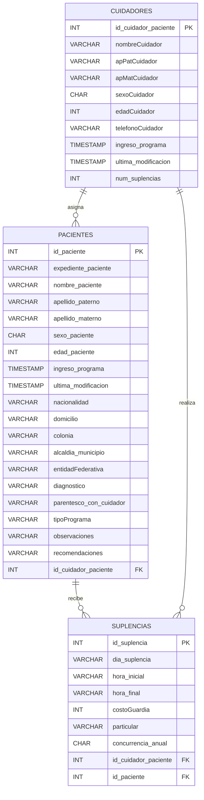

## 📊 Data Model

This section describes the database schema for the **Emotional Respite Therapy System**, including entities, attributes, and relationships.

---

## 🧑‍⚕️ Entity: `pacientes`

Stores personal, medical, and program-related information for patients.

| Field                   | Type         | Description                    |
| ----------------------- | ------------ | ------------------------------ |
| id_paciente             | INT (PK)     | Unique patient identifier      |
| expediente_paciente     | VARCHAR(255) | Patient record number          |
| nombre_paciente         | VARCHAR(255) | First name                     |
| apellido_paterno        | VARCHAR(255) | Paternal last name             |
| apellido_materno        | VARCHAR(255) | Maternal last name             |
| sexo_paciente           | CHAR(1)      | Patient gender                 |
| edad_paciente           | INT          | Patient age                    |
| ingreso_programa        | TIMESTAMP    | Program admission date         |
| ultima_modificacion     | TIMESTAMP    | Last update timestamp          |
| nacionalidad            | VARCHAR(255) | Nationality                    |
| domicilio               | VARCHAR(255) | Address                        |
| colonia                 | VARCHAR(255) | Neighborhood                   |
| alcaldia_municipio      | VARCHAR(255) | Municipality                   |
| entidadFederativa       | VARCHAR(255) | State                          |
| diagnostico             | VARCHAR(255) | Medical diagnosis              |
| parentesco_con_cuidador | VARCHAR(255) | Relationship with caregiver    |
| tipoPrograma            | VARCHAR(255) | Scholarship or private program |
| observaciones           | VARCHAR(255) | Observations                   |
| recomendaciones         | VARCHAR(255) | Medical recommendations        |
| id_cuidador_paciente    | INT (FK)     | Assigned caregiver             |

---

## 🧑‍🦱 Entity: `cuidadores`

Stores information about caregivers assigned to patients.

| Field                | Type         | Description                       |
| -------------------- | ------------ | --------------------------------- |
| id_cuidador_paciente | INT (PK)     | Unique caregiver identifier       |
| nombreCuidador       | VARCHAR(255) | First name                        |
| apPatCuidador        | VARCHAR(255) | Paternal last name                |
| apMatCuidador        | VARCHAR(255) | Maternal last name                |
| sexoCuidador         | CHAR         | Gender                            |
| edadCuidador         | INT          | Age                               |
| telefonoCuidador     | VARCHAR(30)  | Contact phone                     |
| ingreso_programa     | TIMESTAMP    | Program admission date            |
| ultima_modificacion  | TIMESTAMP    | Last update timestamp             |
| num_suplencias       | INT          | Number of substitutions performed |

---

## 🔁 Entity: `suplencias`

Represents caregiver substitutions for specific patients and service periods.

| Field                | Type         | Description                    |
| -------------------- | ------------ | ------------------------------ |
| id_suplencia         | INT (PK)     | Unique substitution identifier |
| dia_suplencia        | VARCHAR(255) | Day of substitution            |
| hora_inicial         | VARCHAR(255) | Start time                     |
| hora_final           | VARCHAR(255) | End time                       |
| costoGuardia         | INT          | Cost of the service            |
| particular           | VARCHAR(80)  | Indicates private service      |
| concurrencia_anual   | CHAR(12)     | Annual service frequency       |
| id_cuidador_paciente | INT (FK)     | Caregiver involved             |
| id_paciente          | INT (FK)     | Patient involved               |

---

## 🔗 Relationships

- **One Caregiver → Many Patients**
  A caregiver can be assigned to multiple patients.
  (`pacientes.id_cuidador_paciente → cuidadores.id_cuidador_paciente`)

- **One Patient → Many Substitutions**
  A patient may receive multiple service substitutions.

- **One Caregiver → Many Substitutions**
  A caregiver may perform multiple substitutions for different patients.

---

## 📊 ER – Entity Relationship Diagram (Conceptual)

